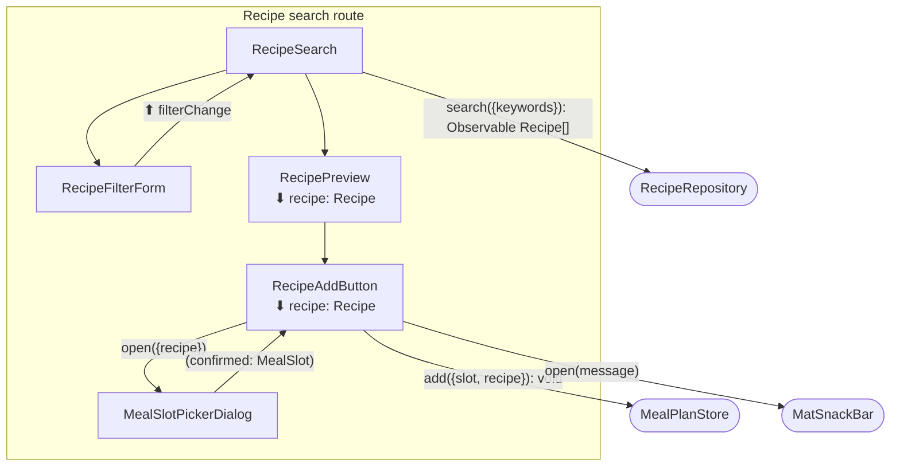
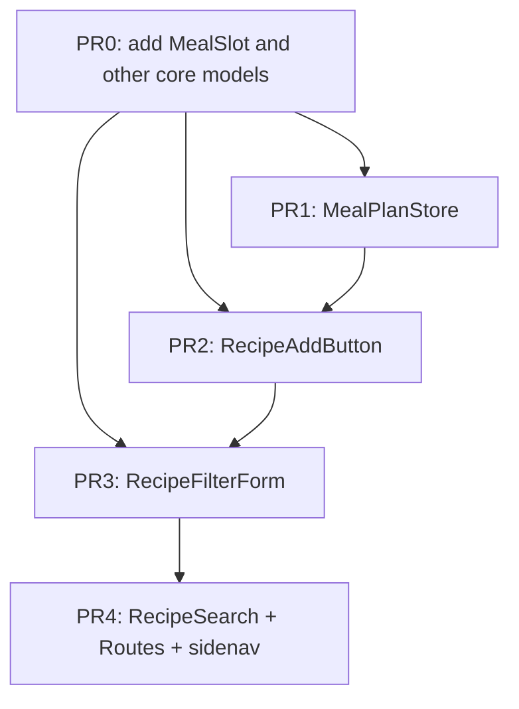

# Goals

- Users need to **find recipes** and **place them on a weekly meal plan** (day + meal slot) without leaving the app or juggling separate flows.
- The recipe search page is the **primary entry point** for filling the plan: search → preview → add to a specific slot.
- This unifies discovery and planning so users can answer “what are we eating this week?” in one place.

# Non-Goals

- **Advanced search filters** beyond a keywords field (e.g. max ingredient/step count, diet, cuisine, cook time).
- **Recipe detail page** — users see card previews only; no dedicated detail route in v1.
- **Meal plan management on the search page** — no viewing, editing, reordering, or removing planned meals here; the search page only adds recipes. The full weekly plan UI lives elsewhere.
- **Server-side persistence** — meal plan state is client-only for v1 (in-memory or local storage).
- **Authentication** — feature works without login; no auth gating in v1.

# Desired Behavior

_Assumptions where not specified — correct any of these before we lock the doc._

- User opens **Recipe Search** from a **sidenav link** (e.g. “Recipes”) and lands on `/recipes/search`.
- **Initial state:** empty catalog with a short prompt to search (no default recipe list).
- User enters **keywords** in a search field and **submits** (button or Enter).
- While loading: show a loading indicator; on success: show a **grid of `wm-recipe-preview` cards** inside `wm-catalog`.
- Each preview card shows the recipe name and picture; an **Add** action sits in the preview’s action slot.
- User clicks **Add** → **dialog** to pick **day of week** (Mon–Sun) and **meal** (breakfast / lunch / dinner).
- User confirms → recipe is stored in **`MealPlanStore`** for that slot; a **snackbar** confirms (e.g. “Added to Tuesday dinner”).
- **Duplicate** same recipe in the **same slot** → prevented; show an error snackbar or inline message; dialog stays open or closes per Material defaults.
- **No results** → empty state: “No recipes found” (keep search term visible).
- **Search/API error** → error message; user can retry.
- **Out of scope on this page:** viewing or editing the full weekly plan (separate route/page later).

# Design

High-level: a routed **recipe search page** loads results via existing **`RecipeRepository.search`**, renders them with existing **`RecipePreview`** + **`Catalog`**, and adds to a new **`MealPlanStore`** after slot selection in a dialog. Routing and sidenav wiring connect the page to the app shell.

**New / extended pieces**

| Piece                           | Role                                                       |
| ------------------------------- | ---------------------------------------------------------- |
| `RecipeSearch`                  | Route host: criteria state, triggers search, holds results |
| `RecipeFilterForm`              | Keywords input + submit                                    |
| `RecipeAddButton`               | Opens slot picker; calls store on confirm                  |
| `MealSlotPickerDialog`          | Day + meal selection; `(confirmed)` / cancel               |
| `MealPlanStore`                 | Client signal store: weekly slots → `Recipe`               |
| `meal-plan.ts`                  | Types: `DayOfWeek`, `MealType`, `MealSlot`, `PlannedMeal`  |
| `recipe.paths.ts` / route entry | `/recipes/search`                                          |

**`MealPlanStore` API (draft)**

- `add({ slot, recipe })` — no-op or error if slot already filled with same recipe id
- `has({ slot, recipeId })` — duplicate check
- `plannedMeals()` — read signal for future meal-plan page

## Diagram

## Implementation Details

- Use **`RecipeFilterCriteria`** with `keywords` only in v1; `createDefaultRecipeFilterCriteria()` for initial state.
- Prefer **`rxResource`** or `switchMap` + signal for search results; debounce not required (submit-driven).
- **`MealPlanStore`**: root `Injectable`, `signal` map keyed by `` `${day}-${meal}` `` or nested record.
- **Duplicate rule:** same `recipe.id` at same `MealSlot` → reject `add` and surface message.
- **Tests:** fake `RecipeRepository` via `provideRecipeRepositoryFake()`; store unit-tested without HTTP.
- Reuse **`RecipePreview`** `<ng-content>` for `RecipeAddButton` (already has `.actions` slot).

# Testing Strategy

## `MealPlanStore`

### Adds recipe to slot:

- Arrange empty store.
- Act `add({ slot: { day: 'tue', meal: 'dinner' }, recipe: burger })`.
- Assert `plannedMeals()` contains burger at Tuesday dinner.

### Rejects duplicate recipe in same slot:

- Arrange store with burger at Tuesday dinner.
- Act `add` same slot and recipe.
- Assert throws or returns error / does not duplicate entry.

## `RecipeFilterForm`

### Submits keywords:

- Arrange mounted form.
- Act type `"salad"` and submit.
- Assert `(search)` output emits criteria with `keywords: 'salad'`.

## `RecipeSearch`

### Shows prompt before search:

- Arrange with fake repository.
- Mount `RecipeSearch`.
- Assert prompt visible; catalog empty.

### Displays results after search:

- Arrange fake repository with Burger and Salad.
- Mount, submit keywords `""` or trigger load per implementation.
- Assert two `wm-recipe-preview` cards with names.

### Shows empty state when no matches:

- Arrange fake repository returning `[]` for `keywords: 'xyz'`.
- Act search `xyz`.
- Assert “No recipes found” (or equivalent).

## `RecipeAddButton` + `MealSlotPickerDialog`

### Adds recipe and shows snackbar:

- Arrange fake store and dialog harness.
- Mount button with burger recipe; click Add; select Tue + dinner; confirm.
- Assert `MealPlanStore.add` called; snackbar text mentions Tuesday dinner.

## Browser (optional slice)

### Happy path add to meal plan:

- Arrange app with fake recipes.
- Visit `/recipes/search`, search, click Add on Burger, pick slot, confirm.
- Assert snackbar and store state (via test hook or meal-plan test API).

# PR Plan

# Alternatives Considered

{alternatives}

# Kitchen Sink

{kitchen_sink}
